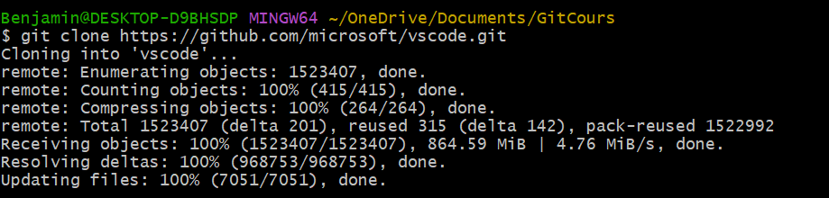
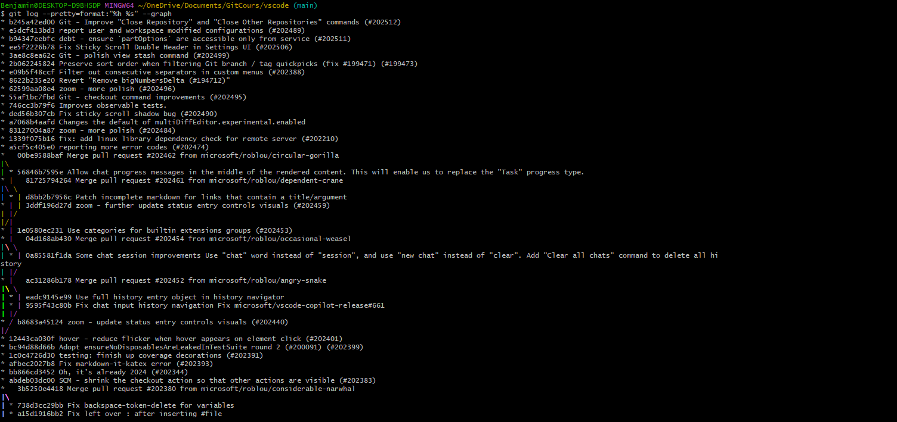
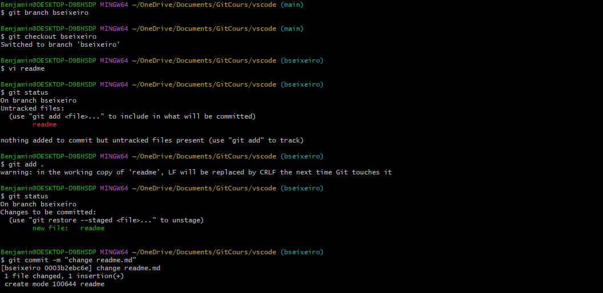

# TP

## TP-1

### TP 1: Introduction et Bases de Git

#### Tâche 1
Clonage du repos de VS Code :
```sh
$ git clone https://github.com/microsoft/vscode
```



#### Tâche 2
Recherche dans les logs : 
```sh
$ git log --pretty=format:"%h %s" --graph
```



#### Tâche 3
Création d'une nouvelle branch : 
```sh
$ git branch <BranchName>
```

Changement de Branche :  
```sh
$ git checkout <BranchName>
```

Indexation :  
```sh
$ git add .
```

Verif de l'état :  
```sh
$ git status
```

Commit avec un intitulé :  
```sh
$ git commit -m "message"
```


### TP 2: Bonnes Pratiques de Codage


